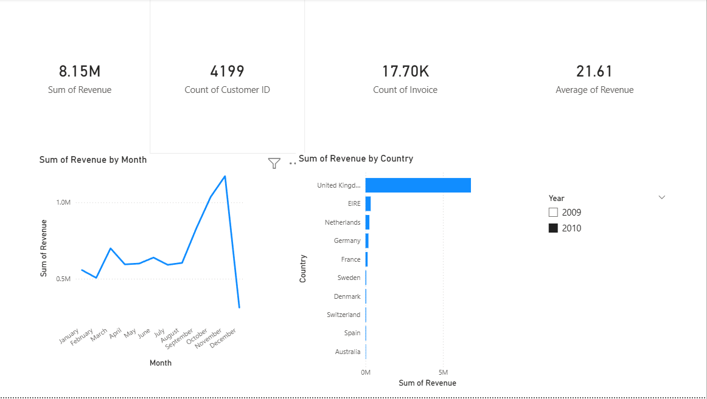
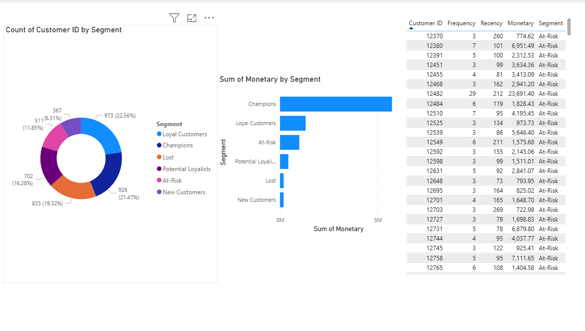

# E-Commerce Customer Churn & Revenue Analysis

## Problem Statement
Revenue was declining despite stable customer acquisition numbers. 
I analyzed 407,664 transactions from a UK-based e-commerce company 
to identify why customers were leaving and provide actionable recommendations.

## Tools Used
| Tool | Purpose |
|------|---------|
| Python (pandas, seaborn) | Data cleaning, RFM segmentation, cohort analysis |
| SQL (SQLite) | Revenue and churn queries |
| Excel | RFM segment summary for stakeholders |
| Power BI | Executive dashboard |

## Key Findings
- 70% of customers never return after their first purchase
- Champions (21% of customers) generate the majority of total revenue
- 511 At-Risk customers represent significant recoverable revenue
- UK accounts for 85%+ of revenue — high concentration risk
- Revenue drop was caused by customer loss, not reduced spending per order

## Recommendations
1. Launch targeted win-back campaign for At-Risk customers within 90 days of last purchase
2. Build 30-day onboarding email sequence — first month is the critical retention window
3. Create VIP programme for Champion segment to prevent high-value churn

## Dashboard Screenshots

### Revenue Overview


### Customer Segments


## Project Structure
```
Project/
├── notebooks/
│   ├── 01_cleaning.ipynb
│   ├── 02_eda.ipynb
│   ├── 03_rfm.ipynb
│   └── 04_cohort.ipynb
├── data/
│   ├── raw/
│   └── cleaned/
├── excel/
└── powerbi/
```

## Dataset
UCI Online Retail II Dataset — 525,000+ transactions, 2009–2011
https://archive.ics.uci.edu/dataset/502/online+retail+ii
